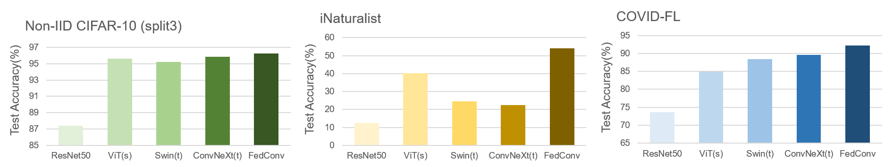

# Implement of FedConv
* **Pytorch implementation for paper:** ["FedConv: Enhancing Convolutional Neural Networks for Handling Data Heterogeneity in Federated Learning"](arxiv:)
* Note that we simulate Federated Learning in one local machine for research usage, do not involve real communication between different clients.

<div align="center">
  
</div>

## Usage
### 0. Installation

- Run `cd FedConv`
- Install the libraries listed in requirements.txt 

### 1. Prepare Dataset 

We provide the data partitions for CIFAR-10, COVID-FL and iNaturalist datasets 

- CIFAR-10 dataset 
    * Download the three sets of simulated data partitions from [CIFAR-10](https://drive.google.com/file/d/17Dz0u1wRqWfN9yXptTsmTe3mL6fGgIQX/view?usp=sharing)
    * Put the downloaded cifar10.npy at sub-folder ```data ```
    
- COVID-FL dataset
    * Download the data and partitions file from [COVID-FL](https://drive.google.com/file/d/1BiG30JJ7U2BT0x92DjwfPeLb-uwTHdUV/view?usp=sharing)

- iNaturalist dataset
    * Download the partition following instructions from [FedScale](https://github.com/SymbioticLab/FedScale/tree/master/benchmark/dataset/inaturalist)

### 2. Set (download) the Pretrained Models
- We provide our models pretrained from Imagenet-1k
    - [FedConv-Normal](https://drive.google.com/file/d/16sI242zjpM2grd_gmeeo4QkOEAfcRhDW/view?usp=sharing)
    - [FedConv-Invert](https://drive.google.com/file/d/1mj53LsN2_a5dRW0hNEBaKt0kaGnfg0tT/view?usp=sharing)
    - [FedConv-InvertUp](https://drive.google.com/file/d/1JIImj1r2wkgSj-a_y41ovkuh8SmkrBNf/view?usp=sharing)
- Then put pretrained model under sub-folder ```checkpoint```

### 3. Train Model
- Use commands below to train models in different datasets
    - CIFAR-10: ```bash cifar_fedconv.sh```
    - COVID-FL: ```bash covid_fedconv.sh```
    - iNatualist: ```bash inat_fedconv.sh```

- All the checkpoints, results, log files will be saved to the ```--output_dir``` folder, with the final performance saved at log_file.txt 

### 4. Trained Models Checkpoint
- We provide our models trained and validated in COVID-FL dataset
    - [FedConv-Normal](https://drive.google.com/file/d/1p8BdYK9n8UlC8Cw6oShHr5CJElvLgPhU/view?usp=sharing)
    - [FedConv-Invert](https://drive.google.com/file/d/1AaYKJB25Bfb_-ETARR3qTZlJI9a0rOZv/view?usp=sharing)
    - [FedConv-InvertUp](https://drive.google.com/file/d/1A85XIQSTYikIhWU-J1k1ANKWR52KmblD/view?usp=sharing)

## Additional Notes
- Some important tags for training setting:  
    - ```--net_name```: name of models to run. In our works, you can choose models directly from resnet50, vit_small_patch16_224, swin_tiny_patch4_window7_224, convnext_tiny, fedconv_base, fedconv_invert, and fedconv_invertup. 
    - ```--dataset```: we provide implement of CIFAR-10 and COVID-FL in  ```main.py```, iNatualist in  ```main_select.py```
    - ```--save_model_flag```: set to True if need to save the checkpoints 
    - ```--output_dir```: the output directory where checkpoints/results/logs will be written 
    - ```--E_epoch```: local training epoch E in FL train
    - ```--max_communication_rounds```: total communication rounds, set 100 in default.
    - ```--split_type```: type of data partitions, supports ["split_1", "split_2", "split_3"] for CIFAR-10, ["real_test"] for COVID-FL and iNatualist.
    - ```--num_local_clients```: Num of local clients joined in each FL train. -1 (usage of all local clients) for CIFAR-10 and COVID-FL, 25 for iNaturalist.  

- Also refer to the ```main.py``` and ```main_select.py``` for more tags

## Acknowledgments
- This work is supported by a gift from Open Philanthropy, TPU Research Cloud Program, and Google Cloud Research Credits program.
- ResNet50, ViT, Swin-Transformer, and ConvNext implementations are based on https://github.com/rwightman/pytorch-image-models
- Our code is based on https://github.com/Liangqiong/ViT-FL-main

